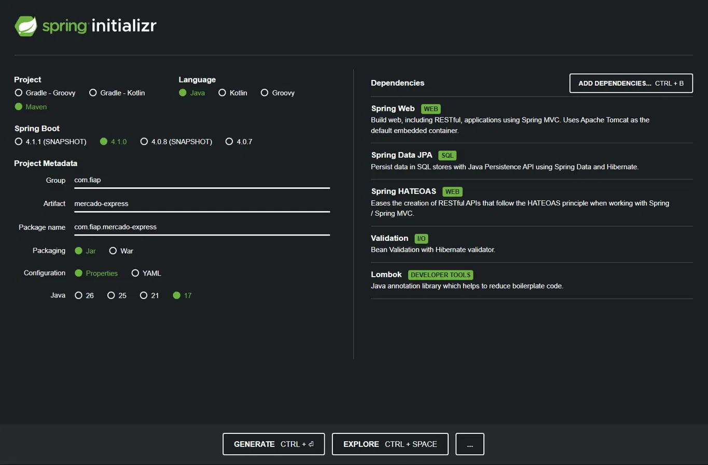
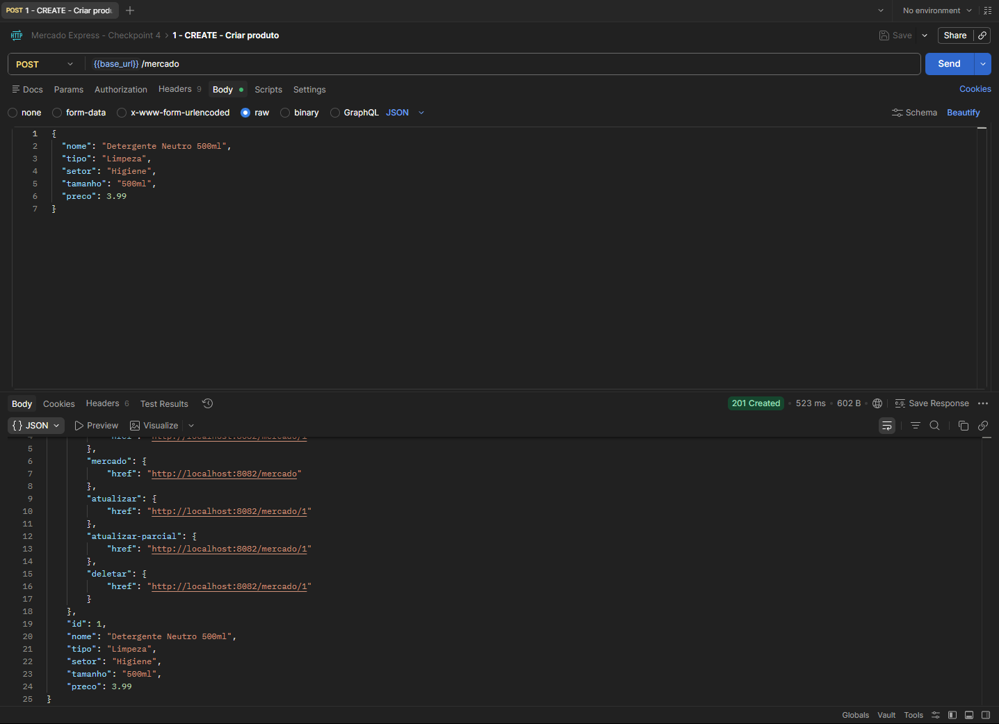
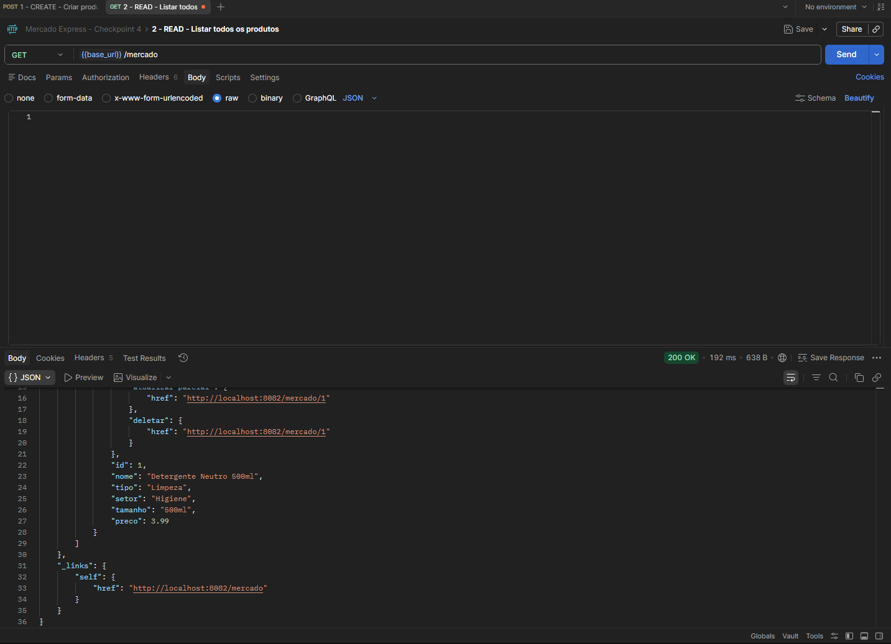
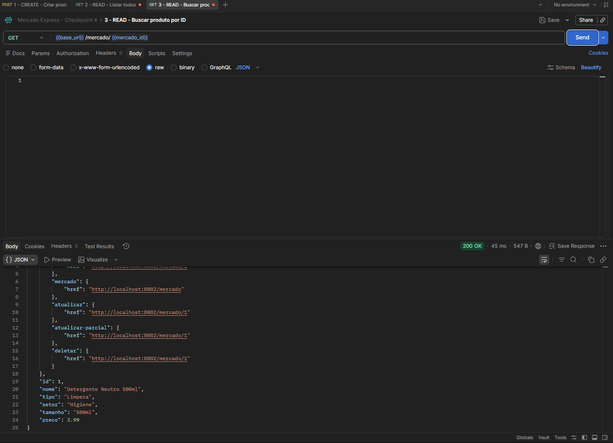
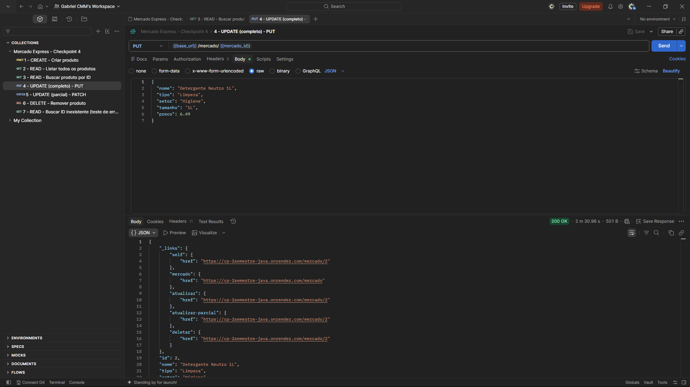
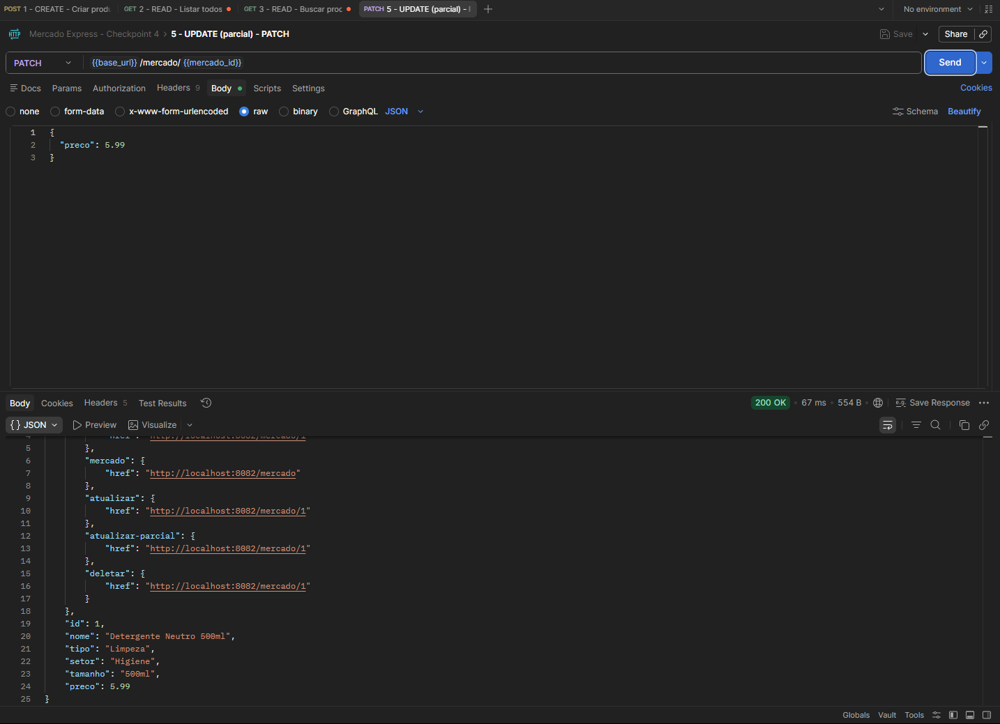
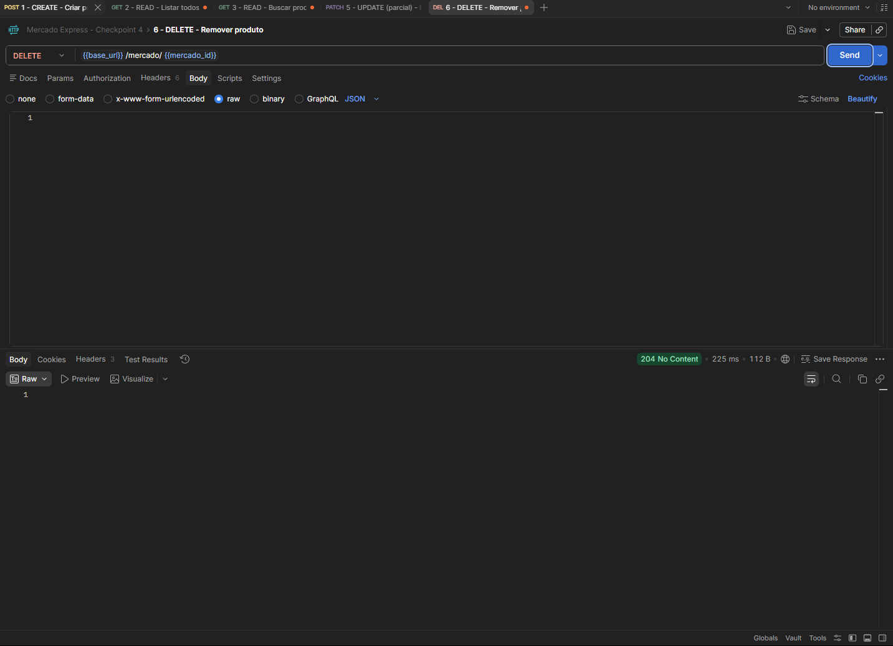

# Mercado Express API

**FIAP – Faculdade de Informática e Administração Paulista**
**Curso:** Tecnologia em Análise e Desenvolvimento de Sistemas (TDS)
**Disciplina/Atividade:** Checkpoint 4 – Parte 1 (API e Deploy)
**Professor:** Dr. Marcel Stefan Wagner

**Integrantes do grupo (nome e RM):**
- Gabriel Cabral Mendes Mariano – RM 563230

**IDE utilizada:** IntelliJ IDEA

**Link do repositório GitHub:** https://github.com/GabrielCabralmm/CP-2Semestre-Java

**Link do Deploy (produção):** https://cp-2semestre-java.onrender.com

---

## 1. Descrição do projeto

API REST desenvolvida com **Spring Boot 4.1.0 (Maven / Java 17)** para uma empresa do tipo
**"mercado express"** (venda de itens como meias, produtos de limpeza, frutas, etc.).

A aplicação:

- Utiliza **Spring Data JPA** para persistência dos dados no banco **Oracle (ORACLE_FIAP)**,
  na tabela `TDS_TB_MERCADO`.
- Utiliza **Lombok** (`@Data`, `@NoArgsConstructor`, `@AllArgsConstructor`) para eliminar
  código boilerplate (getters, setters, construtores) na entidade `Mercado`.
- Implementa o CRUD completo (**C**reate, **R**ead, **U**pdate, **D**elete) através do endpoint
  `/mercado`.
- Retorna as respostas seguindo o padrão **HATEOAS**, no **nível de maturidade 3** do
  Modelo de Maturidade de Richardson — cada recurso retornado traz links (`self`, `mercado`,
  `atualizar`, `atualizar-parcial`, `deletar`) que indicam as próximas ações possíveis.
- Roda no **Tomcat embutido, na porta 8082** localmente (em produção, a porta é definida
  automaticamente pela plataforma de deploy via variável de ambiente `PORT`).
- Está publicada em produção via **Docker** (Render), com as credenciais do banco
  configuradas por variáveis de ambiente (nunca commitadas no código).

### Arquitetura (fluxo de dados)

```
Postman/Insomnia (JSON) <--HTTP--> Controller (Spring) <--Persist--> Repository/EntityManager <--> Banco Oracle (TDS_TB_MERCADO)
```

### Estrutura de pastas

```
mercado-express/
├── pom.xml
├── Dockerfile                              -> build/deploy em produção (Render)
├── Dockerfile.vercel                       -> variante para deploy alternativo na Vercel
├── postman/mercado-express.postman_collection.json  -> coleção de testes pronta
├── src/main/java/com/fiap/mercadoexpress/
│   ├── MercadoExpressApplication.java      -> classe main
│   ├── model/Mercado.java                  -> entidade JPA (com Lombok)
│   ├── repository/MercadoRepository.java   -> Spring Data JPA (EntityManager)
│   ├── controller/MercadoController.java   -> endpoints REST (CRUD) /mercado
│   ├── assembler/MercadoModelAssembler.java-> monta os links HATEOAS
│   └── exception/                          -> tratamento de erros (404)
└── src/main/resources/
    ├── application.properties              -> configuração via variáveis de ambiente
    └── application.properties.example      -> modelo para rodar localmente
```

---

## 2. Tabela no banco de dados

Tabela: **TDS_TB_MERCADO** (banco `ORACLE_FIAP`, criada automaticamente pelo Hibernate
via `spring.jpa.hibernate.ddl-auto=update`).

| Coluna  | Tipo (Java)  | Descrição              |
|---------|--------------|-------------------------|
| ID      | Long         | Chave primária (auto)   |
| NOME    | String       | Nome do produto          |
| TIPO    | String       | Tipo do produto (ex.: Limpeza, Alimento) |
| SETOR   | String       | Setor/Departamento       |
| TAMANHO | String       | Tamanho/Embalagem        |
| PRECO   | Double       | Preço do produto         |

---

## 3. Configuração da conexão com o Oracle

Por segurança, o `application.properties` **não contém credenciais reais** — ele lê tudo
de variáveis de ambiente, tanto localmente quanto em produção:

```properties
server.port=${PORT:8082}
server.address=0.0.0.0

spring.datasource.url=${DB_URL}
spring.datasource.username=${DB_USERNAME}
spring.datasource.password=${DB_PASSWORD}
spring.datasource.driver-class-name=oracle.jdbc.OracleDriver

spring.jpa.database-platform=org.hibernate.dialect.OracleDialect
spring.jpa.hibernate.ddl-auto=update
spring.jpa.show-sql=false
```

**Para rodar localmente:**
1. Copie `src/main/resources/application.properties.example` para `application.properties`
   (esse arquivo real fica de fora do Git, propositalmente).
2. Ou, mais simples: configure as 3 variáveis de ambiente na sua IDE (Run Configuration
   do IntelliJ) antes de rodar:
   - `DB_URL` → `jdbc:oracle:thin:@oracle.fiap.com.br:1521:ORCL`
   - `DB_USERNAME` → seu RM do Oracle FIAP
   - `DB_PASSWORD` → sua senha do Oracle FIAP

**Em produção (Render):** as mesmas 3 variáveis (`DB_URL`, `DB_USERNAME`, `DB_PASSWORD`)
são configuradas no painel de Environment Variables do serviço, sem nunca aparecerem no
código-fonte ou no repositório.

---

## 4. Configuração do Spring Initializr



Configuração utilizada:
- **Project:** Maven | **Language:** Java | **Spring Boot:** 4.1.0
- **Group:** com.fiap | **Artifact:** mercado-express | **Java:** 17

Dependências utilizadas (`pom.xml`):
- Spring Web
- Spring Data JPA
- Spring HATEOAS
- Validation
- Lombok
- Oracle JDBC Driver (`ojdbc11`)
- Spring Boot DevTools

---

## 5. Documentação dos endpoints (CRUD)

> ⚠️ **Atenção ao testar:**
> - A aplicação está publicada no plano gratuito do Render, que "dorme" após 15 minutos de
>   inatividade. A primeira requisição após esse período pode levar de 30 a 90 segundos
>   para responder — isso é comportamento esperado, não é erro.
> - Antes de testar GET por id, PUT, PATCH ou DELETE, rode primeiro o `GET /mercado` para
>   verificar quais ids existem atualmente no banco, já que produtos de testes anteriores
>   podem ter sido removidos.
> - A coleção pronta do Postman está em `postman/mercado-express.postman_collection.json`,
>   já com a variável `base_url` configurável e `mercado_id` para reaproveitar entre os testes.

Base URL de testes:
- **Local:** `http://localhost:8082`
- **Produção:** `https://cp-2semestre-java.onrender.com`

### 5.1. CREATE — `POST /mercado`

Cria um novo produto.

**Request Body (JSON):**
```json
{
  "nome": "Detergente Neutro 500ml",
  "tipo": "Limpeza",
  "setor": "Higiene",
  "tamanho": "500ml",
  "preco": 3.99
}
```

**Response (201 Created) — HATEOAS:**
```json
{
  "id": 1,
  "nome": "Detergente Neutro 500ml",
  "tipo": "Limpeza",
  "setor": "Higiene",
  "tamanho": "500ml",
  "preco": 3.99,
  "_links": {
    "self": { "href": "https://cp-2semestre-java.onrender.com/mercado/1" },
    "mercado": { "href": "https://cp-2semestre-java.onrender.com/mercado" },
    "atualizar": { "href": "https://cp-2semestre-java.onrender.com/mercado/1" },
    "atualizar-parcial": { "href": "https://cp-2semestre-java.onrender.com/mercado/1" },
    "deletar": { "href": "https://cp-2semestre-java.onrender.com/mercado/1" }
  }
}
```



---

### 5.2. READ (listar todos) — `GET /mercado`

**Response (200 OK) — HATEOAS:**
```json
{
  "_embedded": {
    "mercadoList": [
      {
        "id": 1,
        "nome": "Detergente Neutro 500ml",
        "tipo": "Limpeza",
        "setor": "Higiene",
        "tamanho": "500ml",
        "preco": 3.99,
        "_links": {
          "self": { "href": "https://cp-2semestre-java.onrender.com/mercado/1" },
          "mercado": { "href": "https://cp-2semestre-java.onrender.com/mercado" }
        }
      }
    ]
  },
  "_links": {
    "self": { "href": "https://cp-2semestre-java.onrender.com/mercado" }
  }
}
```



---

### 5.3. READ (buscar por id) — `GET /mercado/{id}`

Exemplo: `GET https://cp-2semestre-java.onrender.com/mercado/1`

**Response (200 OK):** mesma estrutura do item 5.1, com os links `self`, `mercado`,
`atualizar`, `atualizar-parcial` e `deletar`.



---

### 5.4. UPDATE (completo) — `PUT /mercado/{id}`

Exemplo: `PUT https://cp-2semestre-java.onrender.com/mercado/{id}`

**Request Body (JSON):**
```json
{
  "nome": "Detergente Neutro 1L",
  "tipo": "Limpeza",
  "setor": "Higiene",
  "tamanho": "1L",
  "preco": 6.49
}
```

**Response (200 OK):** produto atualizado, com os respectivos links HATEOAS.



---

### 5.5. UPDATE (parcial) — `PATCH /mercado/{id}`

Exemplo: `PATCH https://cp-2semestre-java.onrender.com/mercado/{id}`

**Request Body (JSON):** apenas os campos que deseja alterar.
```json
{
  "preco": 5.99
}
```

**Response (200 OK):** produto atualizado apenas no campo `preco`.



---

### 5.6. DELETE — `DELETE /mercado/{id}`

Exemplo: `DELETE https://cp-2semestre-java.onrender.com/mercado/{id}`

**Response:** `204 No Content` (produto removido do banco pelo ID).



---

## 6. HATEOAS – nível de maturidade 3

Cada resposta da API traz, dentro de `_links`, as ações disponíveis para aquele recurso
(`self`, `mercado` (voltar à listagem), `atualizar`, `atualizar-parcial`, `deletar`).
Isso permite que o cliente da API "navegue" entre os recursos apenas seguindo os links
retornados, sem precisar conhecer previamente todas as URLs — característica do nível 3
(HATEOAS) do Modelo de Maturidade de Richardson.

A implementação está em `MercadoModelAssembler`, que usa `linkTo(methodOn(...))` do
Spring HATEOAS para gerar os links dinamicamente a partir dos métodos do `MercadoController`.

---

## 7. Como executar localmente

1. Configure as variáveis de ambiente `DB_URL`, `DB_USERNAME` e `DB_PASSWORD` (veja Seção 3).
2. Rode o projeto pela IDE (botão ▶ na classe `MercadoExpressApplication`) ou, se tiver
   o Maven instalado globalmente:
   ```bash
   mvn spring-boot:run
   ```
3. A API estará disponível em `http://localhost:8082/mercado`.
4. Importe a coleção `postman/mercado-express.postman_collection.json` no Postman e teste
   os endpoints da Seção 5.

---

## 8. Deploy

A aplicação foi publicada no **Render**, utilizando um `Dockerfile` multi-stage (build com
Maven + execução com JRE 17) presente na raiz do repositório. As credenciais do banco Oracle
foram configuradas como variáveis de ambiente (`DB_URL`, `DB_USERNAME`, `DB_PASSWORD`) direto
no painel do Render, nunca ficando expostas no código-fonte.

**Link de produção:** https://cp-2semestre-java.onrender.com

> Observação: por ser um plano gratuito, a instância "dorme" após 15 minutos de inatividade
> e pode levar até 90 segundos para responder à primeira requisição depois de um período
> parado. Isso é esperado e não indica falha na aplicação.
